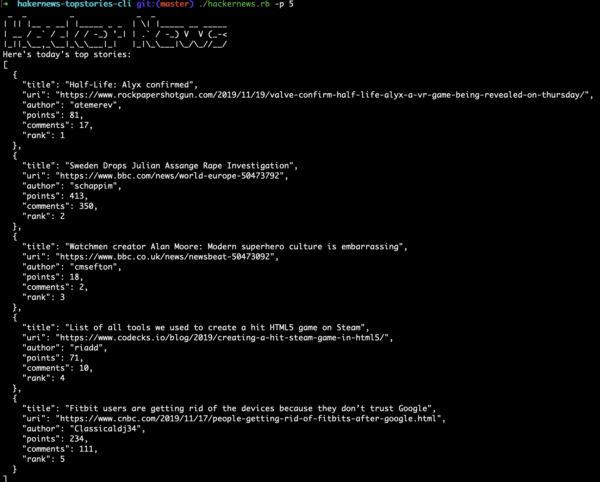

# hakernews-topstories-cli
CLI to retrive n top stories from hakernews

How to run:

 1. Make sure you have Ruby istalled:

 Ruby versions 2.0 and above are included by default in macOS releases since at least El Capitan (10.11).

  Homebrew is a commonly used package manager on macOS. Installing Ruby using Homebrew is easy:

On your terminal: $ brew install ruby

If you you have a different OS, please follow specific instructions on the link below:

https://www.ruby-lang.org/en/documentation/installation/

2. Copy this repo to your local machine and run terminal within its context

  2. a) On Mac, you can run the command below to make the CLI easier to run in the future.

   $ chmod 755 hackernews.rb

3. Application takes the arguments:

--posts / -p how many posts to print -> (A positive integer <= 100)
--help / -h -> brings up a list of commands and their purpose

*Example Input:*

$ ruby hackernews.rb -p 5

or

$ ./hackernews.rb -p 5 (if you ran command 2. a))

*Example output:*

Libraries Used:

OptionParse - CLI Argument management
JSON  - for API data
NET/HTTP - for API call

